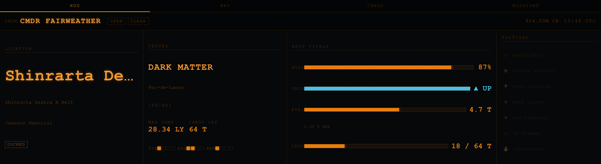
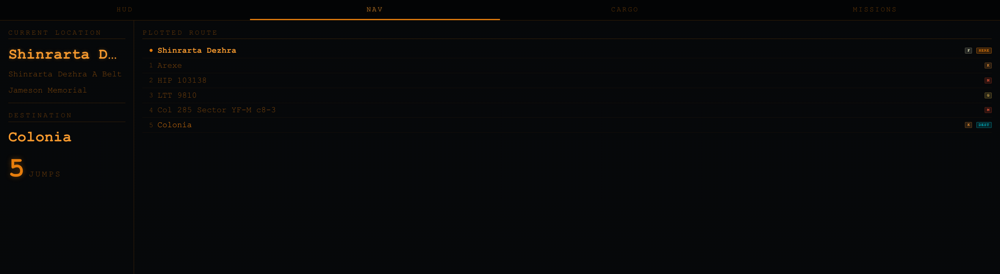
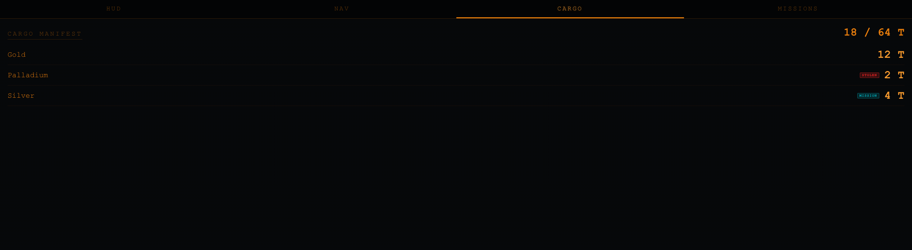
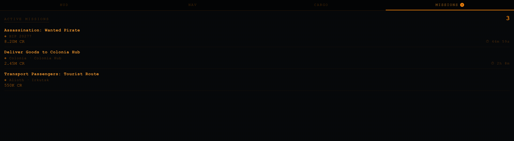

# Xeneon Elite Dangerous HUD

A real-time Elite Dangerous companion widget for the **Corsair Xeneon Edge 14.5"** (2560×720) touchscreen display, built for the Corsair iCUE widget system and targeting Marketplace submission.

Four touch-accessible tabs — HUD, NAV, CARGO, MISSIONS — backed by a local WebSocket companion server that tails your journal files. No polling, no cloud, no API keys.

→ **[Full setup guide](https://cfairweather.github.io/xeneon-elitedangerous/)** (rendered HTML overview)

---

## Screenshots

### HUD — Docked (full XL-H layout)


### HUD — Combat (shields down, wanted, hull critical)


### NAV — Plotted route with star class colour coding


### CARGO — Manifest with mission and stolen tags


### MISSIONS — Active missions with countdown timers


### Connecting to GalNet


### GalNet Signal Lost (data retained on disconnect)


### Medium layout (840px wide)


---

## Tabs

| Tab | What's on it |
|-----|-------------|
| **HUD** | Hull, shields, fuel, cargo bars · power pips · location · legal/mode badges · tactical flags (hardpoints, FSD, silent run, etc.) |
| **NAV** | Current system + station · plotted route list with star class colour coding · jump count and destination |
| **CARGO** | Full cargo manifest sorted alphabetically · tonnes per commodity · STOLEN and MISSION tags · used / capacity |
| **MISSIONS (#)** | All active missions sorted by soonest expiry · destination · credit reward · live countdown timer · orange badge shows count |

---

## Architecture

```
Elite Dangerous (game)
        │  writes Journal.*.log + Status.json every ~1 s
        ▼
%USERPROFILE%\Saved Games\Frontier Developments\Elite Dangerous\
        │
        ▼
companion/server.js  (Node.js — run separately)
        │  WebSocket broadcast  ·  ws://127.0.0.1:31337
        ▼
iCUE widget — com.fairweather.elitedangerous/  (QtWebEngine sandbox)
        │
        ▼
Corsair Xeneon Edge  (14.5" touchscreen, 2560×720)
```

iCUE widgets are sandboxed browser pages — they cannot touch the filesystem or spawn processes. The companion server runs alongside the game and pushes events over a local WebSocket. The widget reconnects automatically with exponential back-off.

---

## Quick start

### 1 — Install the widget

1. Clone or download this repo.
2. Open **iCUE → Xeneon Edge → Widget Builder**.
3. Drag the `com.fairweather.elitedangerous/` folder into Widget Builder.
4. Assign the widget to the **XL-H** slot.

### 2 — Start the companion server

Requires **Node.js 18+** ([nodejs.org](https://nodejs.org)).

```
companion\start.bat
```

First run installs dependencies. Keep the window open while playing.

```bash
# Or manually:
cd companion
npm install      # first time only
npm start
```

The server binds to `127.0.0.1:31337` — not reachable from other machines.

### 3 — Launch Elite Dangerous

The widget shows "Connecting to GalNet" until the server is up and the game emits its first events. Any startup order works.

---

## Companion server

`companion/server.js` — ~200 lines, one npm dependency (`ws`).

| Behaviour | Detail |
|-----------|--------|
| Journal polling | Every 500 ms — byte-offset tail of the latest `Journal.*.log` |
| Status polling | Every 1000 ms — mtime-checked `Status.json` |
| Replay on connect | Last 300 events sent instantly so the widget rebuilds full state |
| Port conflict | Clear error and exit if 31337 is already in use |

Message format (compatible with [elite-dangerous-journal-server](https://github.com/willyb321/elite-journal-node)):

```json
{ "type": "NEW_EVENT",        "payload": { "event": "Docked", ... } }
{ "type": "NEW_STATUS_EVENT", "payload": { "Flags": 12345, "Fuel": {...}, ... } }
```

---

## Journal events consumed

| Event | Data |
|-------|------|
| `LoadGame` | Commander, credits, game mode |
| `Location` | Star system, body, station |
| `FSDJump` | System, fuel level, route advancement |
| `NavRoute` | Full plotted route array (NAV tab) |
| `NavRouteClear` | Clears route display |
| `Docked` / `Undocked` | Station name |
| `Loadout` | Ship details, jump range, cargo capacity |
| `HullDamage` | Hull health |
| `ShieldState` | Shields up/down |
| `Cargo` (with Inventory) | Full cargo manifest |
| `CollectCargo` / `EjectCargo` | Cargo delta |
| `MarketBuy` / `MarketSell` | Cargo delta |
| `MissionAccepted` | Mission name, destination, reward, expiry |
| `MissionCompleted/Failed/Abandoned` | Removes mission |
| `Status` (NEW_STATUS_EVENT) | Flags, fuel, cargo, pips, legal state |

---

## Responsive breakpoints

| Slot | Size | HUD panels |
|------|------|------------|
| XL-H | 2536×696 | Location, Vessel, Vitals, Tactical |
| L-H | ~1800×696 | Location, Vessel, Vitals |
| M-H | ~840×696 | Location, Vitals |
| S-H | ~800×400 | Location, Vitals (stripped) |

Pure CSS — `aspect-ratio` + `min-height` media queries, no JS layout switching. NAV / CARGO / MISSIONS tabs are scrollable single-column and work in any slot size.

---

## Generating screenshots

```bash
pip3 install playwright
python3 -m playwright install chromium

# serve the widget directory, then:
python3 -m http.server 5500 --directory com.fairweather.elitedangerous &
python3 scripts/screenshot.py
```

Output goes to `docs/images/`.

---

## File structure

```
com.fairweather.elitedangerous/     ← iCUE widget package
  manifest.json                     ← Marketplace metadata
  translation.json                  ← i18n stub
  index.html                        ← widget HTML (4-tab shell)
  styles/
    elite-hud.css                   ← ED palette, tab bar, all panel styles
  scripts/
    elite-hud.js                    ← WebSocket, state, tab switching, renderers
  resources/
    icon.svg                        ← ED-style diamond icon

companion/                          ← Node.js companion (run on Windows)
  server.js                         ← Journal + Status.json broadcaster
  package.json
  start.bat                         ← Double-click launcher

scripts/
  screenshot.py                     ← Playwright headless screenshot generator

docs/
  index.html                        ← Rendered setup guide (open in browser)
  images/                           ← Preview screenshots
```

---

## License

Apache License 2.0 — see [LICENSE](LICENSE).

Elite Dangerous is a trademark of Frontier Developments plc. This project is not affiliated with or endorsed by Frontier Developments.
