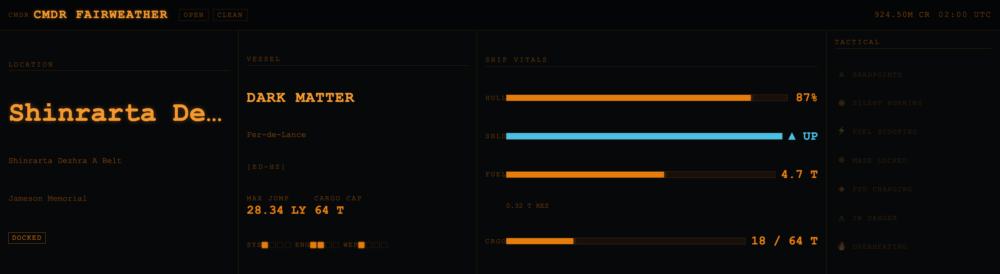
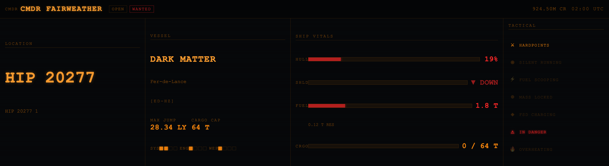
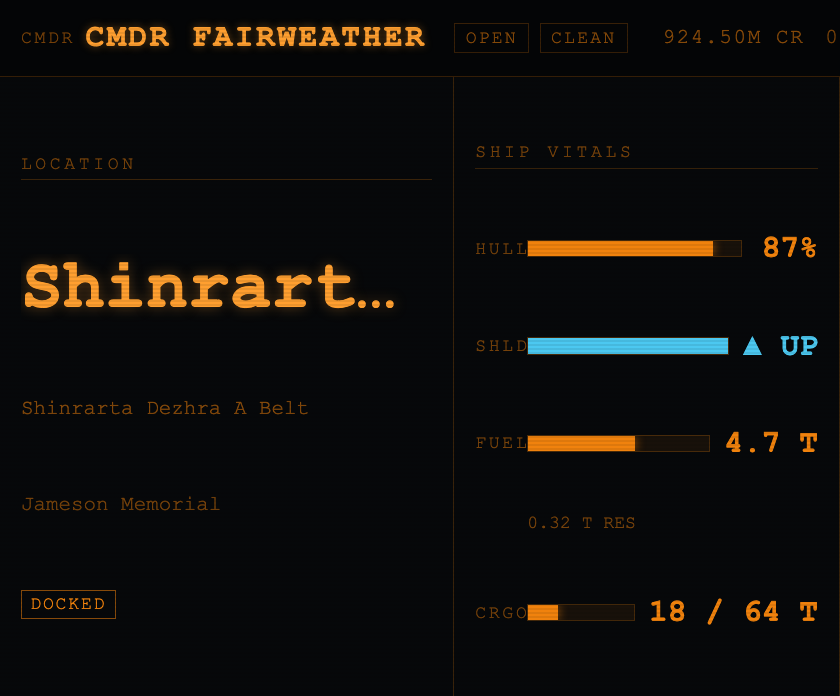

# Xeneon Elite Dangerous HUD

A real-time Elite Dangerous companion widget for the **Corsair Xeneon Edge 14.5"** (2560×720) display, built for the Corsair/Elgato iCUE widget system and targeting Marketplace submission.

The widget connects to a local companion server that tails your Elite Dangerous journal files and streams live game state over WebSocket — no polling, no cloud dependency, no API keys.

---

## Screenshots

### XL-H — Docked (full layout, all four panels)


### XL-H — Combat (shields down, wanted, hull critical)


### Connecting to GalNet


### GalNet Signal Lost (connection dropped, data retained)


### Medium layout (840px wide, two panels)


---

## Features

- **Live data** — hull health, shields, fuel, cargo, credits, jump range, pips, legal state, game mode
- **Tactical flags** — DOCKED, LANDED, SUPERCRUISE, IN HYPERSPACE, INTERDICTED displayed as badge pills
- **Combat state** — hull bar turns orange then red as damage mounts; shield status indicator
- **GalNet overlays** — animated scan-bar "Connecting to GalNet" splash on startup; semi-transparent "Signal Lost" overlay retaining the last known HUD data on disconnect
- **Responsive layout** — four CSS breakpoints adapt the HUD from the full 2536×696 Xeneon slot down to compact 840px or portrait configurations with no JavaScript layout switching
- **ED aesthetic** — authentic orange (#f0820d) and teal (#00c4d4) palette, scanline texture, monospace typography

---

## Architecture

```
Elite Dangerous (game)
        │  writes every ~1 s
        ▼
Journal files + Status.json          ← %USERPROFILE%\Saved Games\…\Elite Dangerous\
        │
        ▼
companion/server.js  (Node.js)       ← ws://localhost:31337
        │  WebSocket broadcast
        ▼
iCUE widget (QtWebEngine)            ← com.fairweather.elitedangerous/
        │
        ▼
Corsair Xeneon Edge display
```

The iCUE widget sandbox cannot spawn system processes, so the journal server runs as a **separate companion app** that you start once before playing. The widget's WebSocket client reconnects automatically with exponential backoff if the server isn't running yet.

---

## Installation

### 1 — Install the widget

1. Download or clone this repository.
2. Open **iCUE** → **Xeneon Edge** → **Widget Builder** (or drag the `com.fairweather.elitedangerous/` folder into the Widget Builder).
3. Assign the widget to the XL-H slot on your Xeneon Edge.

### 2 — Start the companion server (Windows)

The server requires **Node.js 18+** — download from [nodejs.org](https://nodejs.org) if needed.

```
companion\start.bat
```

The first run installs the single dependency (`ws`). Keep the window open while playing. The server binds to `127.0.0.1:31337` — it is not accessible from other machines.

To start manually:

```bash
cd companion
npm install      # first time only
npm start
```

### 3 — Launch Elite Dangerous

The widget will show **"Connecting to GalNet"** until the server is running, then populate with live data as the game emits journal events.

---

## Companion server

**`companion/server.js`** is a lightweight Node.js WebSocket server with one dependency (`ws`).

| Behaviour | Detail |
|-----------|--------|
| Journal polling | Every 500 ms, tails the latest `Journal.*.log` from byte offset — no re-reads |
| Status polling | Every 1000 ms, checks `Status.json` mtime before reading |
| New connection replay | Last 300 journal events replayed immediately so the widget can reconstruct state |
| Disconnect safety | Broadcast loop skips closed sockets; no crash on client drop |
| Port conflict | Exits with a clear error if port 31337 is already in use |

Message format (compatible with [elite-dangerous-journal-server](https://github.com/willyb321/elite-journal-node) convention):

```json
{ "type": "NEW_EVENT",        "payload": { "event": "Docked", ... } }
{ "type": "NEW_STATUS_EVENT", "payload": { "Flags": 12345, "Fuel": { "FuelMain": 4.7, "FuelReservoir": 0.32 }, ... } }
```

---

## Journal events consumed by the widget

| Event | Data extracted |
|-------|---------------|
| `LoadGame` | Commander name, credits, game mode |
| `Location` | Star system, body, station |
| `FSDJump` | Star system, body |
| `Docked` | Station name |
| `Undocked` | Clears station |
| `ShipyardNew` / `ShipyardSwap` | Ship name, type, ident |
| `Loadout` | Ship name, type, ident, hull health, max jump range, cargo capacity, fuel capacity |
| `HullDamage` | Hull health |
| `ShieldState` | Shields up/down |
| `FuelScoop` | Fuel level |
| `CargoTransfer` / `CollectCargo` / `EjectCargo` | Cargo used |
| `Cargo` | Cargo inventory total |
| `Status` (via NEW_STATUS_EVENT) | Flags bitmask, fuel, cargo, pips, legal state |

---

## Responsive breakpoints

| Slot | Approx. size | Panels shown |
|------|-------------|--------------|
| XL-H | 2536×696 | Header, Location, Ship, Vitals, Status |
| L-H | ~1800×696 | Header, Location, Ship, Vitals (Status hidden) |
| M-H | ~840×696 | Header, Location, Vitals (Ship + Status hidden) |
| S-H | ~800×400 | Location, Vitals (header + labels stripped) |

Breakpoints are implemented entirely in CSS using `aspect-ratio` and `min-height` media queries — no JavaScript class toggling.

---

## Generating preview screenshots

Requires Python 3 and a running local preview server (e.g. `python3 -m http.server 5500` from the repo root).

```bash
pip3 install playwright
python3 -m playwright install chromium
python3 scripts/screenshot.py
```

Screenshots are written to `docs/images/`.

---

## File structure

```
com.fairweather.elitedangerous/   ← iCUE widget package
  manifest.json                   ← widget metadata (Marketplace-ready)
  translation.json                ← i18n strings
  index.html                      ← widget HTML shell
  styles/
    elite-hud.css                 ← ED colour palette, scanlines, responsive layout
  scripts/
    elite-hud.js                  ← WebSocket client, state machine, HUD renderer
  resources/
    icon.svg                      ← ED-style diamond icon

companion/                        ← Node.js companion server (run on Windows PC)
  server.js                       ← Journal + Status.json WebSocket broadcaster
  package.json
  start.bat                       ← Double-click launcher for Windows

scripts/
  screenshot.py                   ← Playwright headless screenshot generator

docs/images/                      ← Preview screenshots
```

---

## License

This project is licensed under the **Apache License 2.0** — see [LICENSE](LICENSE) for the full text.

Elite Dangerous is a trademark of Frontier Developments plc. This project is not affiliated with or endorsed by Frontier Developments.
